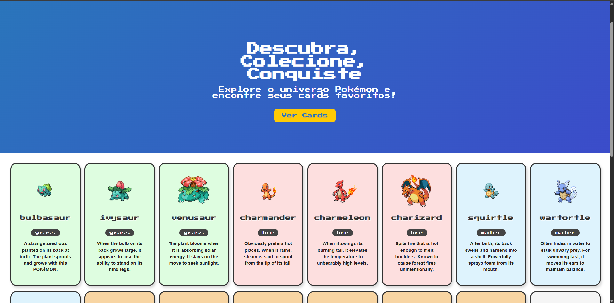
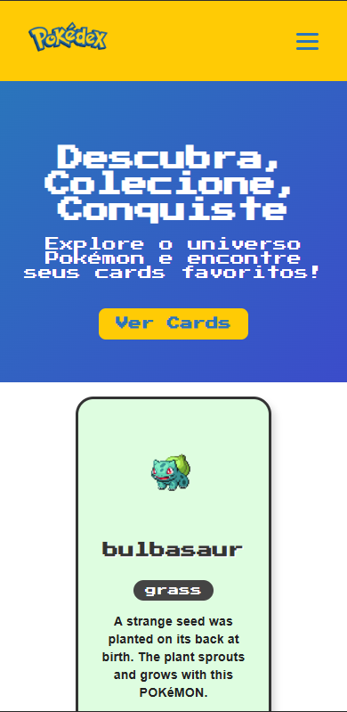

# 📘 Pokédex DevQuest


Uma aplicação web feita com **React** que consome a [PokéAPI](https://pokeapi.co/) para exibir informações detalhadas dos Pokémons. Desenvolvida como desafio técnico da **DevQuest**, com foco em responsividade, design inspirado no estilo 2D/anime da franquia Pokémon e uso de boas práticas com **styled-components**.

---

## 🚀 Funcionalidades

- 🔎 Lista de Pokémons com imagem e nome
- 📄 Página de detalhes com descrições e informações adicionais
- 🎨 Estilo visual inspirado no universo Pokémon
- 🌗 Tema fixo estilizado (claro/anime)
- 📱 Layout responsivo para dispositivos móveis
- 🍔 Menu hambúrguer em telas pequenas
- ⚙️ Componentização com `styled-components`

---

## 📷 Demonstração


### 🏠 Página Inicial


### 📱 Cards Responsivos no Mobile



---

## 🛠️ Tecnologias utilizadas

- React
- React Router DOM
- Styled-components
- JavaScript (ES6+)
- PokéAPI
- HTML5 e CSS3

---

## 📂 Estrutura de pastas

```bash
src/
├── assets/              # Imagens e ícones
├── components/          # Componentes reutilizáveis
│   ├── Header/
│   ├── Footer/
│   ├── Hero/
│   ├── PokemonCard/
│   └── CardsGrid/
├── pages/               # Páginas principais
│   └── Home.jsx
├── App.js               # Componente principal
└── index.js             # Ponto de entrada